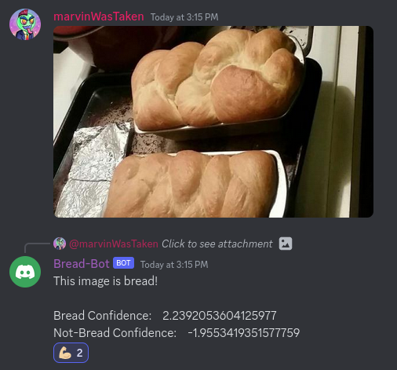

# Bread Bot
### An image classifier that classifies images into two categories: "Bread" and "Not Bread"

The Bread Bot was implemented using the [Vision Transformer model, downloaded from Hugging Face](https://huggingface.co/docs/transformers/model_doc/vit).

One can interact with the Bread Bot either through one off classification / prediction script, or through the Discord Bot.

### Discord Bot
There are two services required to deploy the Bread Bot to Discord, one that acts as the Discord bot, and another which is a web server which houses the classification model.

Both of these services are implemented in Docker Containers, wrapped together using a Docker Compose file.  `Bread-Bot/classifier_server/compose.yaml`

To configure the bot for yourself, you first need to obtain the model.  You can download my pre-trained model from [Google Drive](https://drive.google.com/file/d/174eB5PPoY_br3OCYgGZ-pkuG2749wi43/view?usp=sharing), or take a stab at training it yourself.

After obtaining the model, move the directory that contains the pytorch_model as well as the config.json file to `classifier_server/classifier/outputs/`.

Next set up a Discord bot through discord, get the token and a list of channels you want the Bread Bot to monitor in your Discord server.  Take that information and generate an .env file here `classifier_server/discord/.env` with the following format
```
TOKEN=<your token>
CHANNELS=<channel1>,<channel2>...
```

After all of that is set up, you should be able to run a `docker-compose build` and then `docker-compose up -d` and your bot should be up and running.

Any time an image is uploaded in the particular channels, the bot will run the image through the model and attempt to determine if it is bread or not.




### Dataset
The "Bread" dataset is comprised of images of bread found on the internet, images of bread that I and my friends took, as well as images generated using [Stable Diffusion](https://huggingface.co/spaces/stabilityai/stable-diffusion).

I have the dataset saved off locally; it is not currently posted anywhere on the internet.  If you are interested in a dataset of labeled bread images, reach out to me and I can provide it to you.
